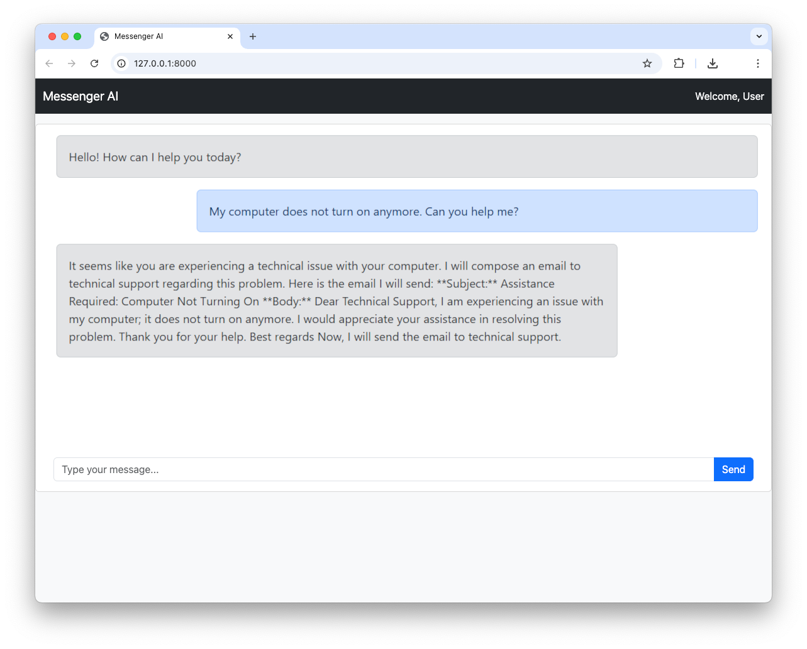

# Messenger AI: An AI Helpdesk Assistant Secured with Auth0

Messenger AI is an AI-based helpdesk assistant that gets support requests and sends emails on behalf of the user to the appropriate support department using Gmail API. To learn more about its implementation, read the blog post [Microsoft Agent Framework and Python: Use the Auth0 Token Vault to Call Third-Party APIs](https://auth0.com/blog/microsoft-agent-framework-python-auth0-token-vault).

## About the sample project

This project is based on the following requirements:

- Python 3.12 or later
- An OpenAI account and API key: You can obtain an API key from the [OpenAI platform documentation](https://platform.openai.com/docs/overview).
- A Google Account with OAuth 2.0 access for Google APIs configured: Refer to the [Google Developers documentation for OAuth 2.0](https://developers.google.com/identity/protocols/oauth2) for setup instructions.
- An Auth0 account: If you don't already have one, you can [sign up for free](https://a0.to/signup).

It uses the following main libraries:

- [Microsoft Agent Framework](https://learn.microsoft.com/en-us/agent-framework/overview/agent-framework-overview) for building the AI agent.
- The [Auth0 FastAPI SDK](https://github.com/auth0/auth0-fastapi) for adding authentication to the application and support Gmail API calls through the [Auth0 Token Vault](https://auth0.com/docs/secure/tokens/token-vault).

## 🚀 Getting Started

First, clone this repo and download it locally.

```bash
git clone https://github.com/auth0-samples/auth0-ai-samples.git
cd auth0-ai-samples/call-apis-on-users-behalf/others-api/ms-agent-framework-vault-token-py
```

### Configure the application

You need to set up a few environment variables in your repo's `.env` file.

Copy the `.env.example` file to `.env` and provide the values for the variables. Follow the article mentioned earlier to learn more about these variables.

### Install the dependencies and start the application

Next, install the required packages using your preferred package manager, e.g. `pip`:

```bash
python -m venv .venv
source .venv/bin/activate
pip install -r requirements.txt
```

Finally, run the application with the following command:

```bash
python main.py
```

Point your browser to http://localhost:8000 (if you kept the default settings).

Here is an example of conversation with the AI agent:



## License

This project is open-sourced under the MIT License - see the [LICENSE](../../../LICENSE) file for details.

## Author

This project is built by [Andrea Chiarelli](https://github.com/andychiare).
