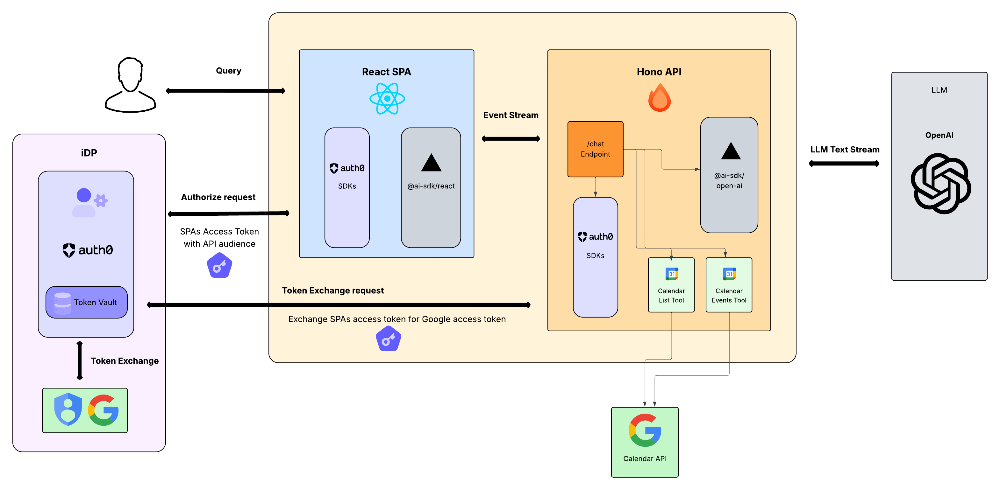

# React.js Single Page Application with Hono API, Auth0 AI, AI SDK, and Token Vault

This is a [React.js](https://react.dev) Single Page Application that implements [Auth0 AI](https://auth0.ai) along with the [AI SDK](https://sdk.vercel.ai/) to create a chat bot with [OpenAI](https://platform.openai.com) as the LLM provider. The application demonstrates how to integrate the AI SDK with Auth0 AI to implement: Authentication & Authorization of apps & APIs with Auth0.



Auth0's Token Vault enables an API to exchange a SPA's access token for a Third-Party API access token. One use case this may help in particular is the case the agent is a Single Page Application (or chatbot), and you would like the backend API to access a Third Party API (such as Google) on the user's behalf. This approach addresses a key security challenge for applications that cannot securely store refresh tokens, such as Single Page Applications. By supporting access tokens as subject tokens, these applications can delegate the token exchange to a trusted backend service that manages the credentials securely.

The flow works by having the client send its access token to a First Party API, which then performs the token exchange using its own client credentials (i.e. client_id and client_secret). This is particularly valuable for scenarios where applications need to access external APIs like Google Calendar or Salesforce without directly managing sensitive refresh tokens.

## Features

The following example app demonstrates using a SPA chatbot application, a backend API (and a linked Resource Server Client), and Token Vault to access a Third Party API (Google Calendar API).

This template leverages a modern stack for building a React SPA application with a Hono API.

- **Full-Stack TypeScript**: End-to-end type safety between client and server
- **Shared Types**: Common type definitions shared between client and server
- **Monorepo Structure**: Organized as a workspaces-based monorepo with Turbo for build orchestration
- **Modern Stack**:
  - [Node.js](https://nodejs.org) as the JavaScript runtime
  - [npm](https://npmjs.com) as the package manager with workspace support
  - [Hono](https://hono.dev) as the backend framework
  - [Vite](https://vitejs.dev) for frontend bundling
  - [React](https://react.dev) for the frontend UI
  - [Turbo](https://turbo.build) for monorepo build orchestration and caching

## Project Structure

```
.
├── client/               # React frontend
├── server/               # Hono backend
├── shared/               # Shared TypeScript definitions
│   └── src/types/        # Type definitions used by both client and server
├── package.json          # Root package.json with workspaces
└── turbo.json            # Turbo configuration for build orchestration
```

## Setup Instructions

### Prerequisites

You will need the following prerequisites to run this app:
- Node.js 18 or later
- npm 7 or later (for workspace support)
- An [OpenAI key](https://platform.openai.com/docs/libraries#create-and-export-an-api-key) for accessing OpenAI
- Setup and configure a Google Cloud Project for use with the Google Connection
   - Enable the [Google Calendar API](https://console.cloud.google.com/apis/library/calendar-json.googleapis.com).
   - Create OAuth 2.0 credentials with proper redirect URIs.

### 1. Auth0 Configuration

1. Create an Auth0 Application:
   - Go to your [Auth0 Dashboard](https://manage.auth0.com/)
   - Create a new **Single Page Application**
   - Configure the following settings:
     - **Allowed Callback URLs**: `http://localhost:5173`
     - **Allowed Logout URLs**: `http://localhost:5173`
     - **Allowed Web Origins**: `http://localhost:5173`
     - Make sure to Allow Refresh Token in Grant Types under Advanced Settings but you can disable "Allow Refresh Token Rotation"

2. Create an Auth0 API:
   - In your Auth0 Dashboard, go to APIs
   - Create a new API with an identifier (audience)
   - Make sure to "Allow Offline Access" in Access Settings 
   - Note down the API identifier for your environment variables

3. Create a Custom API Client (for Token Vault Token Exchange):
   - This client enables Token Vault to exchange an access token for an external API access token (e.g., Google Calendar API).
      - Navigate to `Applications` > `APIs`
      - Click the `Create API` button to create a new Custom API.
      - Go to the Custom API you created and click the `Add Application` button in the right top corner.
      - After that click the `Configure Application` button in the right top corner.
      - Note down the ***client id*** and ***client secret*** for your environment variables.

4. Configure a Social Connection for Google in Auth0
   - Make sure to enable all `Calendar` scopes from the Permissions options
   - Make sure to enable Token Vault for the Connection under the Advanced Settings
   - Make sure to enable the connection for your SPA Application created in Step 1 and the Custom API Client created in Step 3
   - Test the connection in Auth0 "Try Connection" screen and make sure connection is working & configured correctly

### 2. Environment Variables

#### Client (.env)
Copy `.env.example` to `.env` and fill in your Auth0 configuration:

```bash
VITE_AUTH0_DOMAIN=your-auth0-domain.auth0.com
VITE_AUTH0_CLIENT_ID=your-spa-client-id
VITE_AUTH0_AUDIENCE=your-api-identifier
VITE_SERVER_URL=http://localhost:3000
```

#### Server (.env)
Copy `.env.example` to `.env` and fill in your Auth0 configuration:

```bash
# Auth0 Configuration
AUTH0_DOMAIN=your-auth0-domain.auth0.com
AUTH0_AUDIENCE=your-api-identifier

# Resource Server Client Configuration (for Token Vault token exchange)
# These credentials belong to a special "resource_server" client that can perform token exchanges
AUTH0_CUSTOM_API_CLIENT_ID=your-resource-server-client-id
AUTH0_CUSTOM_API_CLIENT_SECRET=your-resource-server-client-secret

# OpenAI Configuration  
OPENAI_API_KEY=your-openai-api-key

# Server Configuration
PORT=3000
```

### 3. Install Dependencies

```bash
# Install all dependencies from the project root
npm install
```

### 4. Run the Application

#### Start server and client in development mode with Turbo:
```bash
npm run dev
```

or run them individually with:
```bash
npm run dev:client    # Run the Vite dev server for React
npm run dev:server    # Run the Hono backend
```

The client will be available at `http://localhost:5173` and will communicate with the server at `http://localhost:3000`.

## Features

- **Authentication**: Users can log in/out using Auth0 Universal Login
- **Protected API Calls**: Authenticated users can call protected endpoints with JWT tokens
- **Public API Calls**: Non-authenticated users can still call public endpoints
- **AI Chat Integration**: Authenticated users can chat with an AI assistant about their calendar
- **Token Exchange**: Token Vault performs token exchanges & securely manages tokens, allowing your API to access external APIs (like Google Calendar API) on behalf of users
- **Type Safety**: Full TypeScript support with shared types between client and server

## API Endpoints

- `GET /` - Public endpoint returning "Hello Hono!"
- `GET /hello` - Public endpoint returning JSON response
- `GET /api/external` - Protected endpoint requiring valid JWT token
- `POST /chat` - Protected AI chat endpoint with calendar integration (token exchange)

## Architecture

### Client (React + Vite)
- Uses `@auth0/auth0-spa-js` for authentication
- React Context for Auth0 state management
- Custom hook (`useAuth0`) for accessing auth state
- JWT tokens are automatically included in API calls

### Server (Hono + Node.js)
- Custom JWT middleware using `jose` library
- Validates tokens against Auth0's JWKS endpoint
- Type-safe API endpoints with shared types
- CORS configured for client-server communication

## SDK Notes

The core `@auth0/ai` package now supports:
- **Resource Server Client Credentials**: Separate client credentials for token exchange operations
- **Access Token Support**: Direct access token exchange instead of requiring refresh tokens

The example uses the enhanced SDK pattern with dedicated access token support:
```typescript
// lib/auth.ts
const auth0AI = new Auth0AI({
  auth0: {
    domain: process.env.AUTH0_DOMAIN!,
    // For token exchange with Token Vault, we want to provide the resource server client (linked client's) credentials
    clientId: process.env.AUTH0_CUSTOM_API_CLIENT_ID!, // Resource server client
    clientSecret: process.env.AUTH0_CUSTOM_API_CLIENT_SECRET!, // Resource server secret
  }
});

export const withGoogleCalendar = auth0AI.withTokenForConnection({
  accessToken: async () => global.authContext?.accessToken, // Access token for Token Vault token exchange
  connection: "google-oauth2",
  scopes: ["https://www.googleapis.com/auth/calendar"]
});
```

Tools can also now use the SDK's built-in token management when using access tokens with Token Vault token exchange:
```typescript
// tools/listNearbyEvents.ts
import { getAccessTokenForConnection } from "@auth0/ai-vercel";

export const listNearbyEvents = withGoogleCalendar(
  tool({
    execute: async ({ start, end, calendarId }) => {
      const token = getAccessTokenForConnection(); // Automatic token retrieval
      // Use token with Google Calendar API...
    }
  })
);
```

## Key Files

- `client/src/lib/auth0.ts` - Auth0 client configuration
- `client/src/contexts/Auth0Context.tsx` - React context provider
- `client/src/hooks/useAuth0.ts` - Auth0 hook for components
- `server/src/middleware/auth.ts` - JWT validation middleware
- `server/src/index.ts` - Hono server with protected routes
- `shared/src/types/index.ts` - Shared TypeScript types

This setup provides a solid foundation for building Auth0-protected Single Page Applications with a secure API backend.

### Additional Commands

```bash
# Build all workspaces with Turbo
npm run build:all

# Or build individual workspaces directly
npm run build:client  # Build the React frontend
npm run build:server  # Build the Hono backend

# Lint all workspaces
npm run lint:all

# Type check all workspaces
npm run type-check

# Run tests across all workspaces
npm run test:all
```

### Deployment

Deploying each piece is very versatile and can be done numerous ways, and exploration into automating these will happen at a later date. Here are some references in the meantime.

**Client**
- [Orbiter](https://orbiter.host)
- [GitHub Pages](https://vite.dev/guide/static-deploy.html#github-pages)
- [Netlify](https://vite.dev/guide/static-deploy.html#netlify)
- [Cloudflare Pages](https://vite.dev/guide/static-deploy.html#cloudflare-pages)

**Server**
- [Cloudflare Worker](https://gist.github.com/stevedylandev/4aa1fc569bcba46b7169193c0498d0b3)
- [Node.js](https://hono.dev/docs/getting-started/nodejs)

## Type Sharing

Types are automatically shared between the client and server thanks to the shared package and TypeScript path aliases. You can import them in your code using:

```typescript
import { ApiResponse } from 'shared/types';
```